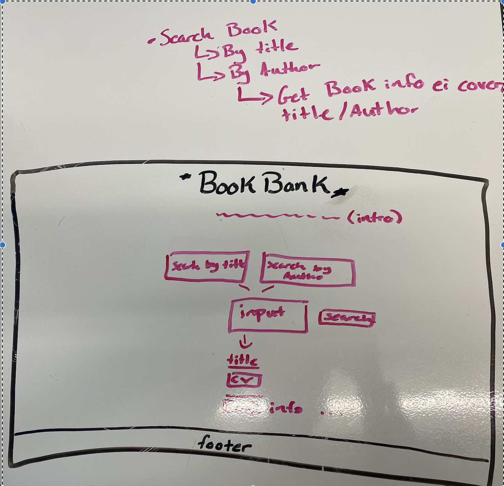

# Title:  **Book Bank** 📖 #

Book Bank is a sleek web application crafted with HTML, CSS, and Node.js, utilizing the Open Library API to offer a rich repository of books. Designed for book lovers, it provides a straightforward platform to search for books by title or author. Additionally, users can explore various subjects in the catalog section, discovering new titles and genres with ease. Whether you're searching for a specific book or looking to stumble upon your next favorite read, "Book Bank" delivers a user-friendly and enjoyable experience. Dive into the world of books with Book Bank – where every search leads to discovery.

# Book Bank Demo Link 🔗

Experience "Book Bank" in action: [Book Bank Live Site](https://jlopez0001.github.io/Book-Bank/)

## Web Layout

**Home Page Layout:**

> 

## Features

- Book search by title or author
- Browse books by subjects
- User-friendly interface
- Real-time data from Open Library API

